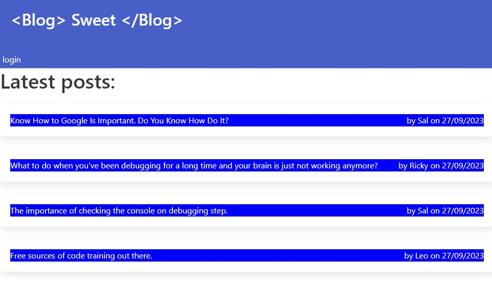

# My Easy Blog

<a href="https://sheltered-brushlands-85919-717ff397d21e.herokuapp.com/">Visit the deployed app!</a>

## DESCRIPTION
This is the project for a basic CMS blog website similar to a Wordpress site, where developers can publish their ideas and comment on other developers posts. This app was built using the Model-View-Controller architecture and tachnologies such as Node, Express and MySql/Sequelize for the back-end and Handlebars template for the front-end.

## TABLE OF CONTENTS
* [Contributing](#contribution)
* [License](#license)
* [Contact](#contact)
## CONTRIBUTING
You are welcome to help if you have any ideas to improve our project! If you want to do so, just follow these steps:

1 - Fork the repository.  
2 - Create a new branch for you new feature or bug fix.  
3 - Make the changes you have in mind.  
4 - Commit your changes and push them to your fork.  
5 - Open a pull request detailing the changes you've made.

## LICENSE
MIT license

Copyright (c) [2023] [Leopoldo Gurgel Barroso Pimentel]

Permission is hereby granted, free of charge, to any person obtaining a copy
of this software and associated documentation files (the "Software"), to deal
in the Software without restriction, including without limitation the rights
to use, copy, modify, merge, publish, distribute, sublicense, and/or sell
copies of the Software, and to permit persons to whom the Software is
furnished to do so, subject to the following conditions:

The above copyright notice and this permission notice shall be included in all
copies or substantial portions of the Software.

THE SOFTWARE IS PROVIDED "AS IS", WITHOUT WARRANTY OF ANY KIND, EXPRESS OR
IMPLIED, INCLUDING BUT NOT LIMITED TO THE WARRANTIES OF MERCHANTABILITY,
FITNESS FOR A PARTICULAR PURPOSE AND NONINFRINGEMENT. IN NO EVENT SHALL THE
AUTHORS OR COPYRIGHT HOLDERS BE LIABLE FOR ANY CLAIM, DAMAGES OR OTHER
LIABILITY, WHETHER IN AN ACTION OF CONTRACT, TORT OR OTHERWISE, ARISING FROM,
OUT OF OR IN CONNECTION WITH THE SOFTWARE OR THE USE OR OTHER DEALINGS IN THE
SOFTWARE.

# CONTACT
* Github: [leopoldogurgel](https://github.com/leopoldogurgel)
* E-mail: leopoldogbp@gmail.com
* Linkedin https://www.linkedin.com/in/leopoldo-gurgel-24a404284/

This file was generated by Easy Readme Generator